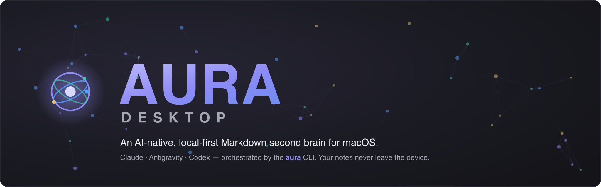
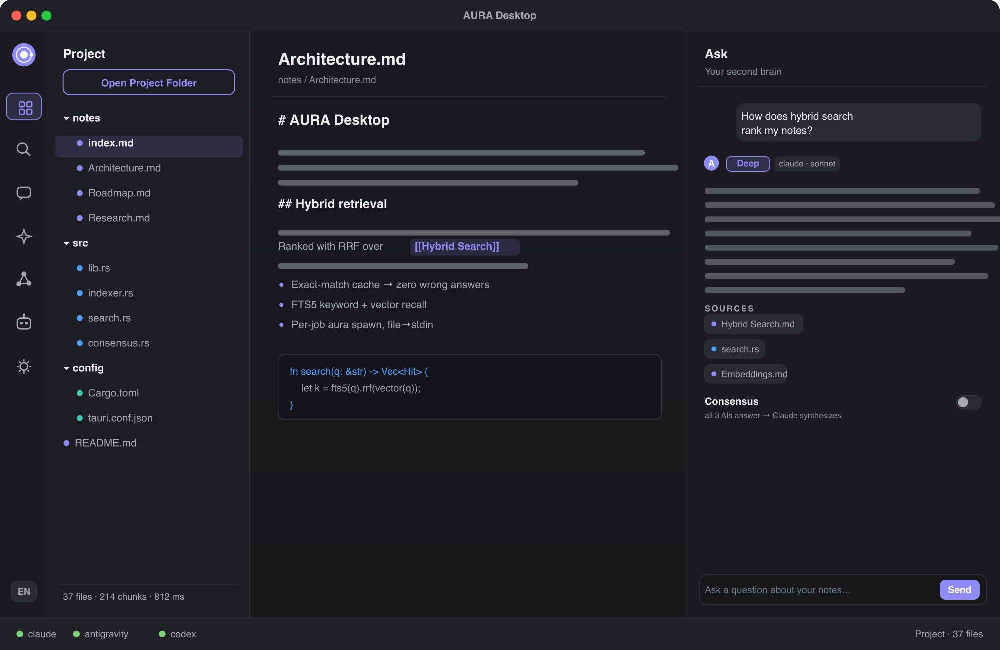
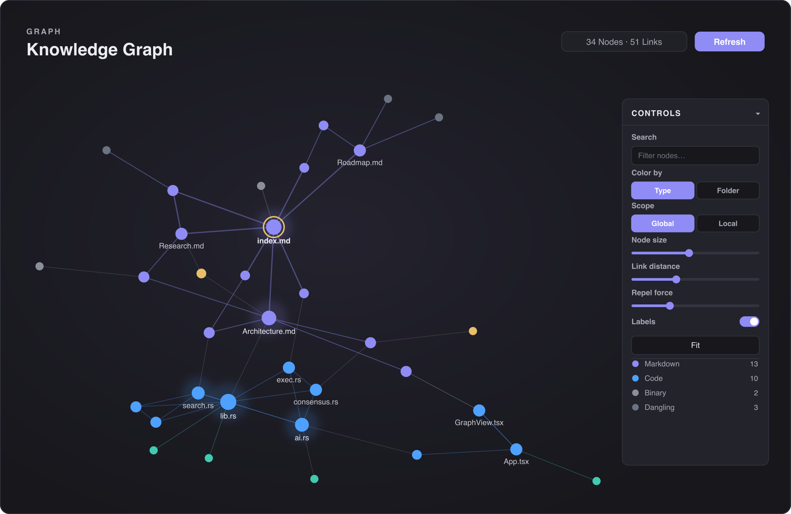
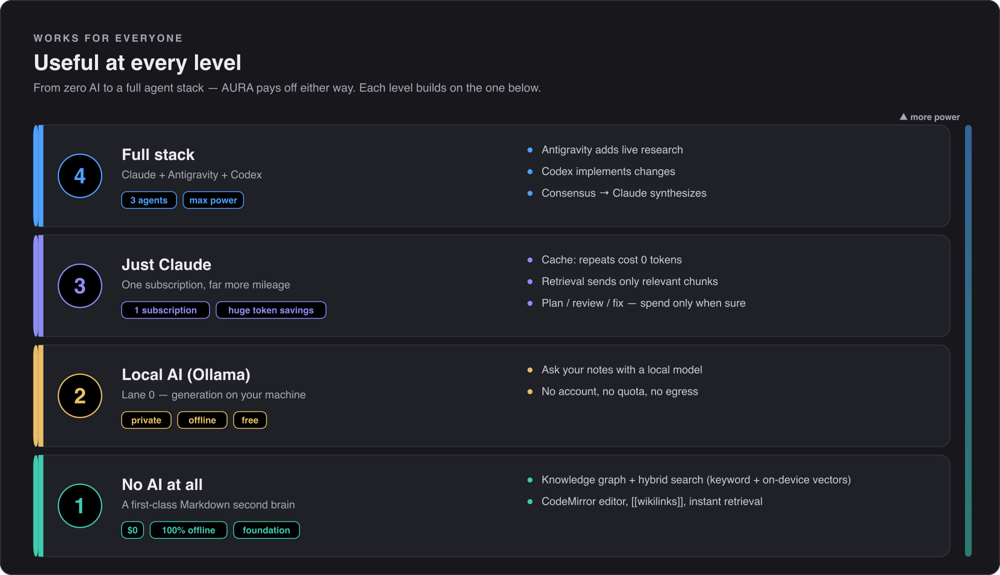
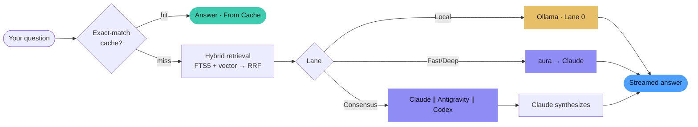
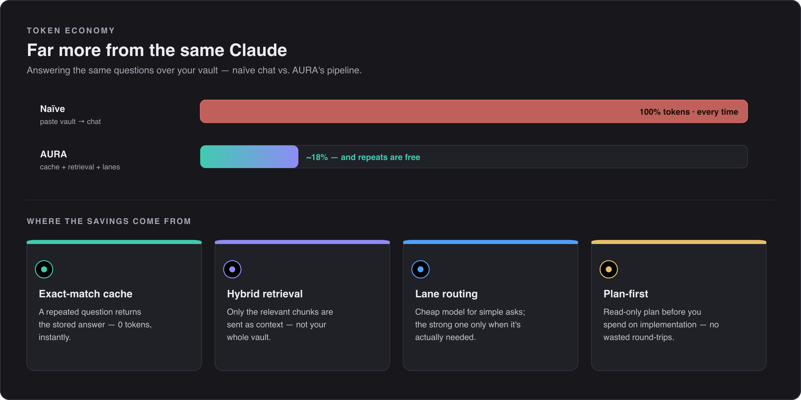
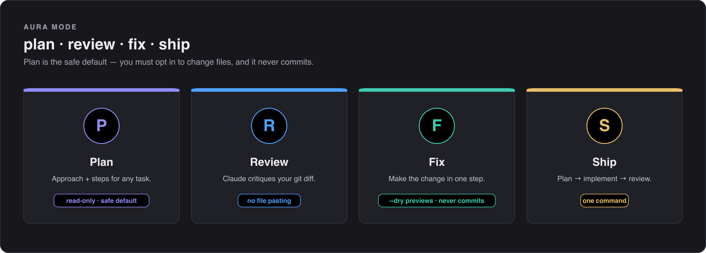
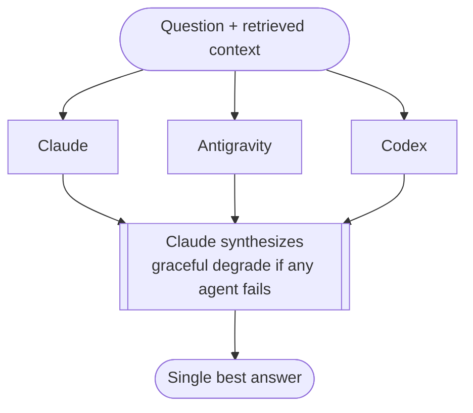
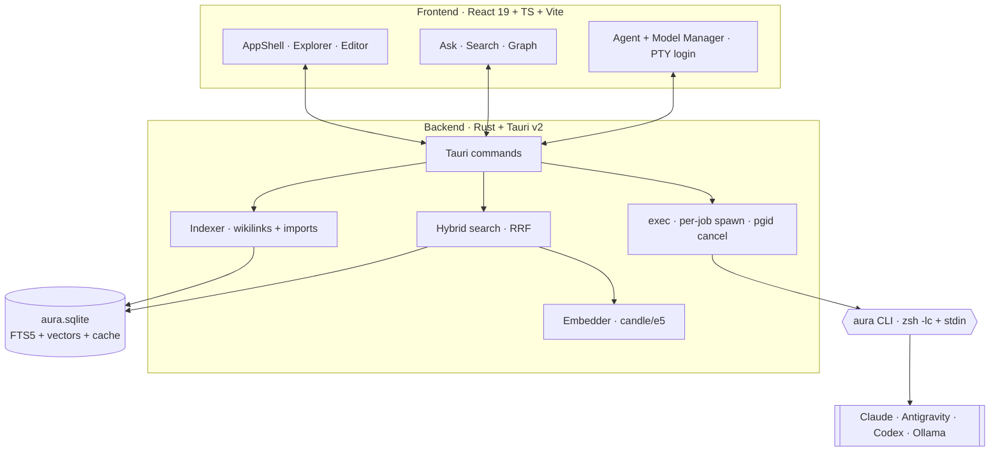

<div align="center">



<br/>

**An AI-native, local-first Markdown second brain for macOS — your notes never leave the device.**

[](https://github.com/cleoanka/aura-app/actions/workflows/ci.yml)
[](#)
[](#)
[](#)
[](#)
[](#)
[](LICENSE)

[Features](#-features) · [Screenshots](#-screenshots) · [How it works](#-how-it-works) · [Architecture](#-architecture) · [Install](#-install--build) · [Türkçe](#-türkçe-özet)

</div>

---

## ✨ What is AURA Desktop?

AURA Desktop is an **Obsidian-style knowledge base** that thinks. It indexes a folder of
your Markdown (and code) files, builds a **knowledge graph** from `[[wikilinks]]` and
cross-language imports, and lets you **ask questions in natural language** that are answered
with retrieval-augmented generation over *your own* notes.

The intelligence comes from the proven [`aura`](https://github.com/cleoanka) CLI orchestrator —
**Claude is the main brain**, with Antigravity (research) and Codex (local implementation) as
optional co-pilots. There is **no bespoke LLM integration to break**: AURA wraps battle-tested
CLIs via `zsh -lc` + `stdin`, spawning a short-lived process per job (no daemon).

> 🔒 **Local-first by design.** Your vault is a plain folder of files. Indexing, embeddings,
> hybrid search and the exact-match answer cache all run **on-device**. Nothing is uploaded
> except the prompt you explicitly send to a cloud agent you've logged into.

> ℹ️ This app is **separate** from the TEKNOFEST *AURA* competition project and from the
> `aura` CLI itself — it is the desktop GUI that wraps the CLI.

<br/>

## 📸 Screenshots

<div align="center">

### Workspace — explorer · editor · Ask


<br/><br/>

### Knowledge Graph — every note & file, linked


</div>

> The visuals above are rendered from a synthetic demo vault — no personal data. Source SVGs
> (and the scripts that generate them) live in [`docs/assets/`](docs/assets).

<br/>

## 🚀 Features

| | |
|---|---|
| 🧠 **Ask your notes** | Hybrid retrieval (**FTS5 keyword + vector → RRF**) feeds RAG. An **exact-match cache** guarantees zero wrong cached answers. Streaming responses with a lane badge. |
| 🕸️ **Knowledge graph** | `react-force-graph` view of every file. Nodes colored by type, sized by degree; `[[wikilinks]]` + cross-language imports as edges; dangling nodes; click → open; local-scope BFS, search, folder/type coloring. |
| 🤝 **Consensus** *(opt-in)* | Ask the same question to Claude + Antigravity + Codex **in parallel**, then **Claude synthesizes** one answer. Gracefully degrades if an agent is down. Off by default. |
| 🛠️ **Aura Mode** | Run `plan / review / fix / ship` on a project folder from inside the app. **Fix only previews** a diff — it never edits files or commits. |
| 🏠 **Two local layers** | (a) on-device embeddings for search & cache (candle/e5), (b) **Lane 0** local generation via Ollama (opt-in, off by default). |
| 🧩 **Agent Manager** | Detect / install / **log in (embedded PTY)** / health / rate-limit for Claude, Antigravity & Codex — right inside the app. |
| 🔑 **Bring your own key** | Optional **BYOK**: run on your own Anthropic API key instead of a subscription. Stored locally (`~/.aura`, `0600`), shared with the CLI, never uploaded. Off by default. |
| ✍️ **Editor** | CodeMirror 6 Markdown editor, Obsidian-dark theme, custom icon set. |
| 🌍 **EN / TR** | Full English & Turkish UI with a live toggle. |
| 🧰 **Zero-config & robust** | Starts with sensible defaults; a corrupt settings field falls back instead of crashing. |

<br/>

## 💡 Why it pays off — at every level

AURA isn't only for people with a stack of AI subscriptions. It earns its place whether you have
**none, one, or all three** agents — and the *same install* scales up as you do.

<div align="center">

</div>

- **No AI at all** — AURA is already a first-class local second brain: a knowledge graph built from
  your `[[wikilinks]]`, hybrid search (keyword **+ on-device** vector embeddings), and a Markdown
  editor. 100% offline, **$0**, nothing leaves your machine.
- **Local AI only** — point **Lane 0** at Ollama and query your notes with a model running on your
  own hardware. Private, offline, no account, no quota.
- **Just Claude** — where it shines even with a *single* subscription: the pipeline is built to
  **spend as few tokens as possible** (see below), so one plan goes much, much further.
- **Full stack** — add Antigravity (research) and Codex (implementation), with consensus on top.

<br/>

## 🔍 How it works

When you **Ask**, the request flows through a deterministic pipeline before any model is called —
the cheapest path that can answer, wins:



### The token economy — more from the same Claude

Even with only Claude, AURA is designed to **minimize what you spend**. The cheapest path that can
answer always wins, so most questions never hit a paid model at full price:

<div align="center">

</div>

- **Exact-match cache** — ask the same thing twice and the second answer is free and instant (0 tokens).
- **Hybrid retrieval** — only the *relevant* chunks become context, instead of pasting your whole vault.
- **Lane routing** — simple asks use the light model; the strong one is reserved for when it's needed, and complex prompts auto-escalate only then.
- **Plan-first** — read-only **Plan** lets you think before you spend on implementation.

### Aura Mode — plan / review / fix / ship

Beyond Q&A, AURA runs the `aura` engine's workflow modes on a project folder, straight from the app:

<div align="center">

</div>

- **Plan** *(safe default)* — outlines the approach and steps, read-only.
- **Review** — Claude critiques your current `git diff` — no copy-pasting files into a chat.
- **Fix** — makes the change in one step; `--dry` previews the patch first, and it **never commits**.
- **Ship** — plan → implement → review in a single command.

This is why AURA replaces a lot of manual back-and-forth: you describe intent, it does the
mechanical, token-heavy work, and you stay in control of what actually changes.

**The consensus path** runs three agents concurrently and lets the main brain reconcile them:



<br/>

## 🏗️ Architecture



- **Backend** — Rust + Tauri v2. One `aura.sqlite` holds FTS5, vectors and the cache.
  Each AI job spawns a **short-lived `aura` process** (no daemon); cancel = process-group kill;
  prompts/context are passed **file → stdin** (no shell-injection surface).
- **Frontend** — React 19 / TypeScript / Vite, Obsidian-dark theme.
- **Engine** — the `aura` CLI wraps Claude / Antigravity / Codex; AURA Desktop never talks to a
  model API directly.

Deep dives: **[`docs/ARCHITECTURE.md`](docs/ARCHITECTURE.md)** ·
[`docs/philosophy.md`](docs/philosophy.md) (the soul) ·
[`docs/simple.md`](docs/simple.md) (zero-jargon) ·
[`docs/glossary.md`](docs/glossary.md) ·
[`docs/ultraplan-FINAL.md`](docs/ultraplan-FINAL.md) ·
[`docs/ROADMAP.md`](docs/ROADMAP.md) · [`PROGRESS.md`](PROGRESS.md).

Contributing: **[`CONTRIBUTING.md`](CONTRIBUTING.md)** (constitution + green-gates) ·
[`CHANGELOG.md`](CHANGELOG.md) · the constitution is enforced by
[`scripts/soul_check.py`](scripts/soul_check.py) in CI.

<br/>

## 🔐 Privacy & security

- **Local-first.** The vault is plain files; indexing, embeddings, hybrid search and the cache are on-device.
- **Explicit egress only.** Data leaves the machine *only* in a prompt you send to a cloud agent you logged into.
- **No shell injection.** Prompts and context are written to `0600` temp files and piped via `stdin`, never interpolated into a shell line.
- **Fix is read-only.** Aura Mode's *Fix* previews a diff; it never writes files or commits.
- **Auth stays where it lives.** Claude → macOS Keychain; Antigravity / Codex → their own credential files. AURA never copies or stores tokens.
- **BYOK is local.** An optional Anthropic API key lives in a `0600` file under `~/.aura` (the same one the CLI uses), is injected only into the agent you run, and is never printed in full or uploaded by AURA.
- **Indexing skips junk.** `.git`, `node_modules`, `target`, `dist`, … plus your vault's own `.gitignore` **and `.auraignore`** entries are excluded, so build caches (and anything you mark private) can't bloat the index or leak into context.

<br/>

## 📦 Install & build

**Requirements:** macOS (Apple Silicon), Rust 1.93+, Node 24+, Xcode Command-Line Tools, and the
`aura` CLI on your `PATH`. The three sub-CLIs can be authenticated from the in-app **Agent Manager**.

```bash
cd app
npm install
npm run tauri dev      # development (a window opens)
npm run tauri build    # release .app + .dmg → src-tauri/target/release/bundle/
```

### Distribution (notarization)

Release `.app` / `.dmg` are produced ad-hoc-signed and run locally. For public distribution you
need an **Apple Developer ID**: `codesign --options runtime` → `xcrun notarytool submit --wait` →
`stapler staple`. Phase-0 decision: **non-sandboxed Developer ID + hardened runtime +
`com.apple.security.inherit`** so the child CLIs can reach their own Keychain/file auth.

<br/>

## 🧭 Usage

1. **Open a project folder** (your vault) from the Workspace.
2. AURA **indexes** it — Markdown, code and config, with cross-file links.
3. **Search** (hybrid) or **Ask** a question; watch the lane badge to see which path answered.
4. Open the **Graph** to explore how everything connects.
5. Use **Aura Mode** to `plan / review / fix / ship` a codebase — safely.
6. Manage and log in to agents from **AI & Models**.

<br/>

## 🧱 Tech stack

`Tauri 2` · `Rust 1.93` · `React 19` · `TypeScript 5.8` · `Vite 7` · `CodeMirror 6` ·
`react-force-graph-2d` · `d3-force` · `xterm` + `portable-pty` · `SQLite (FTS5)` ·
`candle` (e5 embeddings) · `Ollama` (optional local generation).

<br/>

## 📊 Status

Core is complete and the release **`.app` + `.dmg` build, open and run** without crashing:
23+ Rust tests pass, the frontend builds clean (0 type errors), and the AI engine contract
(`--json-events`, `doctor --json`) passes. Built autonomously with the `aura` model itself —
**Opus 4.8** (orchestrator/architect) + **Codex** (implementer) + **Antigravity** (verification).
Full breakdown in [`PROGRESS.md`](PROGRESS.md); known limits & plans in [`docs/ROADMAP.md`](docs/ROADMAP.md).

<br/>

## 🇹🇷 Türkçe özet

**AURA Desktop**, macOS (Apple Silicon) için **AI-native, yerel-öncelikli Markdown "ikinci beyin"**
uygulamasıdır — notların cihazdan çıkmaz.

**Her seviyede işe yarar:** *Hiç AI'ın olmasa bile* tam bir yerel ikinci beyin (bilgi grafiği +
hibrit arama + editör, %100 çevrimdışı, $0). *Sadece yerel AI* ile (Ollama/Lane 0) notlarını
cihazında sorgularsın. *Sadece Claude'un olsa bile* boru hattı **token tüketimini minimumda
tutar** (cache → tekrarlar bedava, retrieval → sadece ilgili parçalar, lane → ucuz/güçlü ayrımı,
plan-önce), yani tek abonelik çok daha uzağa gider. *Üçü birden* varsa araştırma + implementasyon +
consensus eklenir.

- **Token ekonomisi:** exact-match cache (tekrar = 0 token), sadece ilgili chunk'lar context'e, lane yönlendirme, plan-önce → aynı Claude'dan kat kat fazla iş.
- **Aura Modu avantajı:** `plan` (salt-okunur, güvenli varsayılan) / `review` (git diff'ini eleştirir, dosya yapıştırma yok) / `fix` (`--dry` önizler, asla commit etmez) / `ship`.
- **Notlarına sor:** hibrit arama (FTS5 + vektör → RRF) + RAG, **exact-match cache** (sıfır yanlış cevap), streaming yanıt.
- **Bilgi grafiği:** `[[wikilink]]` + diller-arası import'lardan üretilen, tipe göre renklendirilmiş etkileşimli graf.
- **Consensus** *(opsiyonel, varsayılan KAPALI):** soru aynı anda Claude + Antigravity + Codex'e sorulur, **Claude sentezler**.
- **Aura Modu:** `plan / review / fix / ship` app içinden — **Fix yalnız önizler**, dosya değiştirmez, asla commit etmez.
- **Agent Manager:** Claude / Antigravity / Codex'i app içinden algıla / kur / giriş (gömülü PTY) / sağlık.
- **Gizlilik:** indeksleme, embedding, arama ve cache **cihazda**; veri yalnızca senin gönderdiğin prompt ile çıkar.
- **Motor:** her şey `aura` CLI üzerinden — **Claude ana beyin**. Doğrudan model API entegrasyonu yok.

Kurulum İngilizce [Install & build](#-install--build) bölümünde. Mimari detaylar:
[`docs/ARCHITECTURE.md`](docs/ARCHITECTURE.md).

<br/>

## 📄 License

[MIT](LICENSE) © 2026 Hikmetullah Çevik ([@cleoanka](https://github.com/cleoanka))

<div align="center"><sub>Built with the <code>aura</code> model — Opus 4.8 · Codex · Antigravity.</sub></div>
