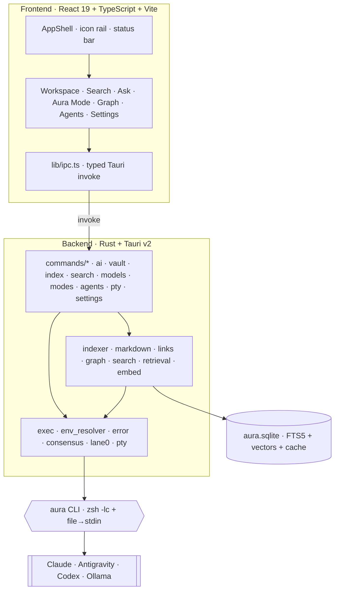
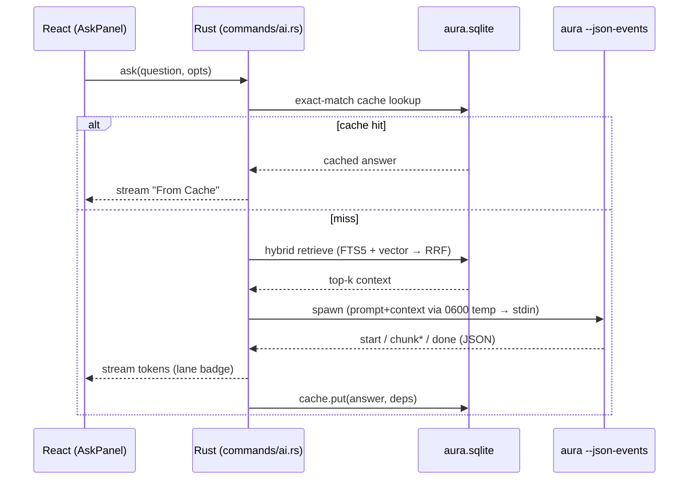

# AURA Desktop — Architecture

A technical tour of how AURA Desktop is put together: the process model, the data
layer, the Ask pipeline, the consensus engine, and the security boundaries. For a
high-level overview see the [README](../README.md); for build progress see
[`PROGRESS.md`](../PROGRESS.md) and [`ROADMAP.md`](ROADMAP.md).

---

## 1. Big picture

AURA Desktop is a **Tauri v2** application: a **Rust** backend and a **React/TypeScript**
frontend, sharing a single SQLite database, with all AI work delegated to the external
**`aura` CLI** (which itself wraps Claude, Antigravity and Codex).



**Key principle:** AURA never speaks a model API. It shells out to `aura`, which is the
single source of truth for *which* agent runs and *how* it authenticates.

---

## 2. Process & execution model

- **Per-job spawn, no daemon.** Each AI request launches a short-lived `aura` process.
  Phase-0 measured the cold-start overhead at **~30 ms** (≪ the 1.5 s threshold), so a
  long-running daemon was rejected as unnecessary complexity.
- **Cancellation = process-group kill.** Jobs run in their own pgid; *Stop* kills the whole
  group, so no orphaned children survive.
- **Streaming via `--json-events`.** `aura` emits `start → chunk → done` JSON events; the
  backend forwards them over a Tauri `Channel` so the UI streams tokens live.
- **`zsh -lc` environment, captured once.** The login shell is run **a single time** per
  session (`env_resolver` caches the result in a `OnceLock`); every subsequent agent spawn reuses
  that snapshot with no shell at all. So the user's real `PATH` (Homebrew, npm-global,
  `~/.local/bin`) is resolved **without** paying the ~100–300 ms `.zshrc`/`.zprofile` cost on each
  job — the per-job overhead is just the process spawn.



---

## 3. Data layer

A single **`aura.sqlite`** holds everything:

| Concern | How |
|---|---|
| **Keyword search** | SQLite **FTS5** virtual table (real, not emulated). |
| **Semantic search** | Vector column + brute-force cosine (sqlite-vec ANN is a planned upgrade). |
| **Answer cache** | `cache` + `cache_deps` tables — **exact-match** keying for zero false-positive answers; invalidated by note content hash. |
| **Metadata** | `meta` table; `links` table (v2) for the cross-file graph. |

> **Note on the SQLite binding.** The implementer agent ran offline and could not fetch
> `rusqlite`/`sqlite-vec`, so the data layer currently uses the **system `libsqlite3` via FFI**.
> Migrating to `rusqlite` + `sqlite-vec` (real ANN) is tracked tech-debt — see [ROADMAP](ROADMAP.md).

#### Cache invalidation — kept in sync with file hashes

A cached answer is only served while it would still be *produced the same way*. Two layers, both
keyed on file content, guarantee this (regression-tested in `tests/cache_invalidation.rs`):

1. **Retrieval fingerprint in the cache key.** Every ask re-runs retrieval first; the cache key
   includes the resulting candidate set (note + heading). If you add a new file that changes what
   gets retrieved, the fingerprint changes → the key changes → **miss** (a fresh answer). If
   retrieval is unchanged, the model would see the same context, so a hit is correct.
2. **Per-dependency content-hash check.** `cache_get_valid` compares each dependency note's stored
   hash against its *current* hash; an in-place edit (or a deleted/moved chunk) flips the entry to
   invalid → **miss**. Writes are transactional, so a partial write can never leave a "valid" entry
   with missing deps.

This is why a busy vault still benefits from the cache: only answers whose actual sources changed
are recomputed.

### Indexer

`indexer.rs` walks the vault and builds the graph incrementally:

- **All file types**, not just Markdown — with cross-language edges.
- **Exclusions**: a built-in denylist (`.git`, `node_modules`, `target`, `dist`, `build`,
  `.venv`, `__pycache__`, …) **plus the vault's own top-level `.gitignore`** (simple entries) is
  applied as the walk's `filter_entry`, so black-hole folders are pruned at the subtree root and
  never bloat the index or trip OOM. Text files are also capped at 1.5 MB.
- **Links** (`links.rs`): `[[wikilinks]]`, Markdown links, and language imports
  (`py / rs / ts / js / go / c …`) plus generic mentions.
- **Chunking**: hierarchical, code-aware, with a **content hash** so unchanged files are skipped on re-index.
- **Graph**: a `petgraph` model (`graph.rs`) exposed to the frontend as `{ nodes, links }`
  with `kind` hints used for type coloring.

### Embeddings

`embed.rs` defines an `Embedder` trait so the backend stays model-agnostic:

- **Default**: real **candle / e5** embeddings when the model is cached locally; otherwise it
  **does not download at startup** (a hang fix) and falls back to a deterministic stub + FTS5.
- e5 `passage:` / `query:` prefixes, `Device::Cpu` (Accelerate), L2-normalized vectors,
  partial top-k. Model download is an explicit action in **AI & Models**.

---

## 4. The Ask pipeline (lanes)

The cheapest path that can answer wins. Lanes, in order of cost:

1. **From Cache** — exact-match cache hit. Instant, free, zero risk of a wrong cached answer.
2. **Local (Lane 0)** — on-device generation via **Ollama** (opt-in, off by default).
3. **Fast / Deep** — `aura → Claude` with retrieved context.
4. **Consensus** — all three agents in parallel, Claude synthesizes (opt-in).

The active lane is surfaced to the user as a **badge** on every answer.

---

## 5. Consensus engine

`consensus.rs` fans the same prompt out to Claude + Antigravity + Codex concurrently and has
**Claude synthesize** a single answer. It is built to **degrade gracefully**:

- One agent only → return it directly.
- Synthesis unavailable → titled concatenation of the raw answers.
- Claude-only still works.

Off by default (it costs ~3×). Deadlock and grace-timeout edge cases are covered by
`consensus_degrade.rs` / `consensus_prompt.rs` tests.

---

## 6. Frontend

React 19 + TypeScript + Vite, Obsidian-dark theme (`src/styles/theme.css`).

```
src/
  App.tsx                     # view router
  components/
    AppShell.tsx              # icon rail + status bar (agent health dots)
    Sidebar/VaultExplorer.tsx # file tree
    Editor/NoteEditor.tsx     # CodeMirror 6 Markdown editor
    Ask/AskPanel.tsx          # RAG Q&A, streaming, lane badge, sources
    Search/SearchPanel.tsx    # hybrid search (Keyword / Semantic / Hybrid)
    Graph/GraphView.tsx       # react-force-graph knowledge graph
    AuraMode/AuraModePanel.tsx# plan / review / fix / ship
    Agents/… Models/…         # Agent Manager + Model Manager
    Pty/PtyLogin.tsx          # embedded xterm OAuth login
  i18n/                       # EN/TR string table + live toggle
  lib/ipc.ts                  # typed wrappers over Tauri invoke
```

The **GraphView** colors nodes by type (markdown · code · config · binary · external ·
dangling), sizes them by degree, and offers global/local scope, BFS depth, search
(highlight/filter), folder/type coloring, force sliders and a live legend.

---

## 7. Security model

| Boundary | Guarantee |
|---|---|
| **Local-first** | Vault is plain files; indexing, embeddings, search and cache are on-device. |
| **Egress** | Data leaves only inside a prompt you send to a cloud agent you've logged into. |
| **Injection** | Prompt + context are written to **`0600` temp files** and piped via **stdin** — never interpolated into a shell command. |
| **Path traversal** | `vault.rs` guards reads/writes to the vault root (`vault_guard` test). |
| **Loopback** | Lane 0 only talks to a verified loopback URL — userinfo-bypass (`http://localhost@evil.com`) is rejected (`gen_loopback` test). |
| **Fix safety** | Aura Mode *Fix* is **dry-run only** — previews a diff, never writes or commits. |
| **Auth** | Claude → macOS **Keychain**; Antigravity / Codex → their own credential files. AURA never copies tokens. |
| **BYOK** | Optional Anthropic API key in a `0600` file under `~/.aura` (shared with the CLI). Injected into a child **only** when `api_key_enabled` is on; surfaced masked (`sk-…aB3d`); never logged in full or uploaded. |

**Entitlements (Phase-0 decision):** non-sandboxed **Developer ID + hardened runtime +
`com.apple.security.inherit`**. No `keychain-access-groups`, no
`allow-unsigned-executable-memory`. This lets spawned child CLIs reach their own auth while
keeping the runtime hardened.

---

## 8. Contracts & testing

- **`doctor` contract** — `contracts/doctor.schema.json` + `doctor.fixture.json` are the single
  source of truth for the agent-health JSON shape, validated from **both** Python (`aura`) and
  Rust (`doctor_contract.rs`).
- **Rust** — 23+ tests pass: `db_smoke`, `indexer_smoke`, `search_rrf`, `settings_robust`,
  `cache_key`, `vault_guard`, `pty_argv`, `modes_argv`, `consensus_*`, `lane0_ollama`,
  `gen_*`, `links_*`, `prune`, `advanced_realdb`, …
- **Frontend** — `vitest` component/i18n tests; `tsc + vite build` is clean (0 type errors).
- **CI** — [`.github/workflows/ci.yml`](../.github/workflows/ci.yml).

---

## 9. Build & distribution

```bash
cd app
npm install
npm run tauri dev      # dev window
npm run tauri build    # → src-tauri/target/release/bundle/  (.app + .dmg)
```

Dev/local builds run ad-hoc-signed. Public distribution needs an Apple Developer ID:
`codesign --options runtime` → `xcrun notarytool submit --wait` → `stapler staple`.

---

## 10. Source map

| Path | What |
|---|---|
| `app/src/` | React frontend |
| `app/src-tauri/src/` | Rust backend (commands, indexer, search, exec, consensus, …) |
| `app/src-tauri/tests/` | Rust integration tests |
| `app/src-tauri/capabilities/` | Tauri v2 ACL (`default.json`) |
| `contracts/` | `doctor` JSON schema + fixture (Python↔Rust contract) |
| `vendor/` | pinned `aura` engine snapshots (`aura-0.4.0.py`, `aura-patched.py`) |
| `docs/assets/` | README visuals (SVG sources + generators + PNG renders) |
| `docs/` | architecture, roadmap, master plan (`ultraplan-FINAL.md`), Phase-0 findings |
